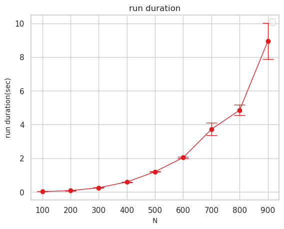

# step2
Programs for STEP development course :D
<!-- START doctoc generated TOC please keep comment here to allow auto update -->
<!-- DON'T EDIT THIS SECTION, INSTEAD RE-RUN doctoc TO UPDATE -->
**Table of Contents**

- [step2](#step2)
  - [assignment 2](#assignment-2)
    - [1](#1)
    - [2](#2)
    - [3](#3)
  - [assignment3](#assignment3)
    - [1](#1-1)
    - [2](#2-1)
    - [3](#3-1)

<!-- END doctoc generated TOC please keep comment here to allow auto update -->
## assignment 2
### 1 
matrix.cpp
入力: N (int) 
出力: duration average and duration variance (sec)

{1,2,3...10}からランダムに選択して行列A,Bを作成し、A*Bを計算するまでにかかる時間を計測する。
これを10回繰り返し、実行時間の平均と標準偏差を計算して出力する。

実行結果は以下のようになった。このコードで最も時間がかかるのは multiplyMatrix()で三重のforループを回している部分でO($N^3$)となっている。
グラフを見るとNが増えるにしたがって、実行時間は$N^3$の比率で増加している。

### 2
ハッシュテーブルじゃなくて木構造を使う理由

- ハッシュテーブルではあらかじめメモリを多く確保する必要があるが木構造ではその必要はない

- データ数の増加に伴ってハッシュテーブルは作り直すことがあるが木構造では必要ない

- ハッシュテーブルではハッシュによる値の偏りがあるとハッシュテーブルを新しく作る必要があるが木構造でwはその手間がない

- ハッシュをどのように設定するか悩む必要がない

- 木構造の方がハッシュテーブルよりキーが整列されているので検索以外の操作に対応しやすい。最大値、最小値を求めたりなど

### 3
最も直近にアクセスされたページ上位X個をキャッシュするようにほぼO(1)で実現するデータ構造
サイズが常にX個に保たれたハッシュテーブルとキューを用意する。キューのサイズもX以下になるようにする。
ハッシュテーブルはURL,Webページの管理に使用し、キューはそれらのアクセス順を管理するために用いる。

[A]がアクセスされた時の挙動を考える。

1. ハッシュテーブルで[A]のURL,WEbページが存在するか調べる

2. 存在した場合、キューからAの要素を抜き出す。＊ここでAが銭湯でない限りO(1)でAを抜き出せないため、修正が必要。
   4.へ

3. 存在しなかった場合
キューのサイズがX個であれば先頭の要素を取り出してハッシュテーブル、キューから削除

4. キューの末尾に[A]を追加し、ハッシュテーブルにAのURLとWebページの情報を入れる

## assignment3

宿題1~3の内容は全て modularized_calculator.py　にある。
### 1

evaluate(tokens),tokenize()の中身を変更し、readTimes(line, index)、readDivision(line, index) を追加した。
tokenize()の中では'*','/'を」読み込んだ時にreadTimes(line, index)、readDivision(line, index)を呼び出す部分を追加した。
evalate()ではまず'*','/'の操作を一つ目のwhileないで行い、その後に'+','-'の計算をしている。
一つ目の "*","/" の計算を行う際に、"a,*,b,/,c" という数式を "0,+,0,+,a*b/c" として計算している。

### 2
runTest()内にテストケースを追加した。
四則演算の記号がないもの、全ての四則演算について小数点つきと小数点のない数の場合でそれぞれテストケースを追加した。
また、全ての四則演算の処理が入ったケースも追加した。

### 3
hundleFormula(tokens)で括弧の中身を抜き出してevaluate()に計算する。
括弧を読み込む時に何重目の括弧かを"layer"に記録しておく。
まず式内に最大何重の括弧()があるか数え、最も内側にあるカッコからその中身を計算し、出てきた値をtokensに入れ直す。次は一つ外側の括弧に移動してその中身を計算していく。
これを繰り返す。

具体的には、最後のテストケース　3 * ( 4 - 1 ) + ( ( 5 - 1 ) * 3 + 1 ) / 3　を計算する時、まず括弧が二重までであることを調べる。
次に二重の内側の括弧の中から計算する。この時点では 3 * ( 4 - 1 ) + ( 4 * 1 * 1 * 3 + 1 ) / 3となる。
次に一重の括弧を計算する。　3 * 3 * 1 * 1 + 13 * 1 * 1 * 1 * 1 * 1 / 3　が得られ、最後にこれをevaluate()で計算して答えを求める。

tokensのリストをindexでなめていっているので括弧内を計算した後に括弧内の演算子や数字の要素を消去できないため、代わりに*1や+0を入れて対応した。
tokensから新しいリストを作っていってそれを使って新しい計算をする方法かevaluate()を再帰関数にして書く方法もあるのでそちらも書くかもしれない。
→ modularized_calculation_saiki.pyに書きました。
tokensから()や、乗除演算を計算した後の数式をnew_tokensに格納していって最終的にnew_tokenで和と差の計算を行い、答えを出力します。
tokensから()の中身を計算する時にevaluate()を再起的に呼び出しています。"+" , "-" に関してはその直後の数字とともにnew_tokensの末尾に追加し、 "＊" , "/" に関しては
new_tokensの末尾の数字に対して計算していくようにしています。
